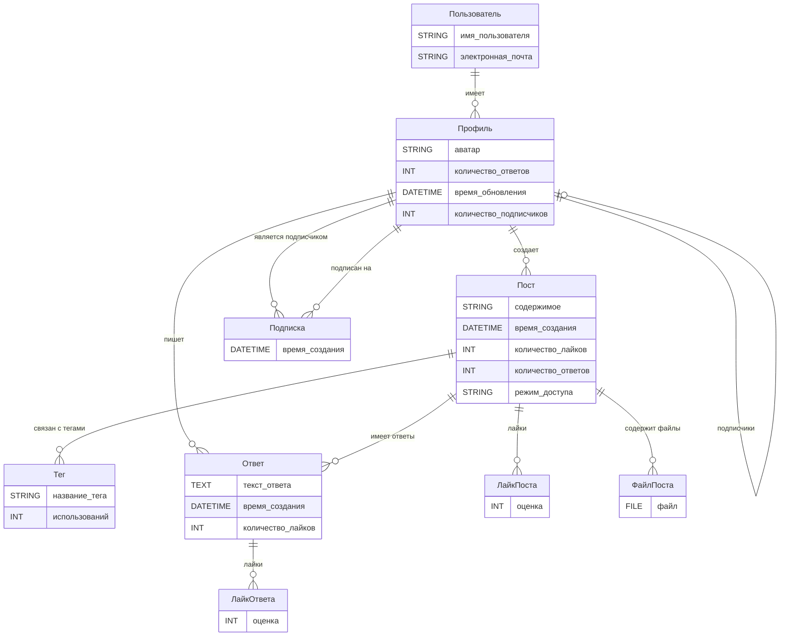

для генерации картинок

python3 my_uml.py

```mermaid
erDiagram

    %% Entity Definitions

    Пользователь {
        STRING имя_пользователя
        STRING электронная_почта
    }

    Профиль {
        STRING аватар
        INT количество_ответов
        DATETIME время_обновления
        INT количество_подписчиков
    }

    Тег {
        STRING название_тега
        INT использований
    }

    Пост {
        STRING содержимое
        DATETIME время_создания
        INT количество_лайков
        INT количество_ответов
        STRING режим_доступа
    }

    Ответ {
        TEXT текст_ответа
        DATETIME время_создания
        INT количество_лайков
    }

    ЛайкПоста {
        INT оценка
    }

    ЛайкОтвета {
        INT оценка
    }

    Подписка {
        DATETIME время_создания
    }

    ФайлПоста {
        FILE файл
    }

    %% Relationships

    Пользователь ||--o{ Профиль : "имеет"
    Профиль ||--o{ Пост : "создает"
    Профиль ||--o{ Ответ : "пишет"
    Профиль ||--o| Профиль : "подписчики"
    Пост ||--o{ Ответ : "имеет ответы"
    Пост ||--o{ ЛайкПоста : "лайки"
    Ответ ||--o{ ЛайкОтвета : "лайки"
    Пост ||--o{ Тег : "связан с тегами"
    Пост ||--o{ ФайлПоста : "содержит файлы"
    Профиль ||--o{ Подписка : "является подписчиком"
    Профиль ||--o{ Подписка : "подписан на"
```
