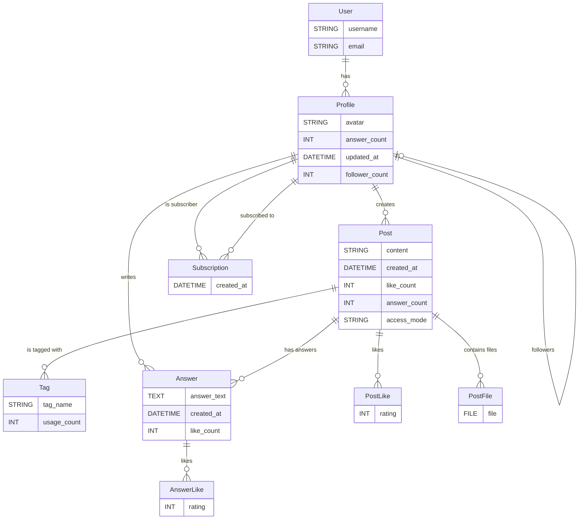

```mermaid

erDiagram
    %% Entity Definitions
    
    User {
        STRING username
        STRING email
    }

    Profile {
        STRING avatar
        INT answer_count
        DATETIME updated_at
        INT follower_count
    }

    Tag {
        STRING tag_name
        INT usage_count
    }

    Post {
        STRING content
        DATETIME created_at
        INT like_count
        INT answer_count
        STRING access_mode
    }

    Answer {
        TEXT answer_text
        DATETIME created_at
        INT like_count
    }

    PostLike {
        INT rating
    }

    AnswerLike {
        INT rating
    }

    Subscription {
        DATETIME created_at
    }

    PostFile {
        FILE file
    }

    %% Relationships

    User ||--o{ Profile : "has"
    Profile ||--o{ Post : "creates"
    Profile ||--o{ Answer : "writes"
    Profile ||--o| Profile : "followers"
    Post ||--o{ Answer : "has answers"
    Post ||--o{ PostLike : "likes"
    Answer ||--o{ AnswerLike : "likes"
    Post ||--o{ Tag : "is tagged with"
    Post ||--o{ PostFile : "contains files"
    Profile ||--o{ Subscription : "is subscriber"
    Profile ||--o{ Subscription : "subscribed to"
```
