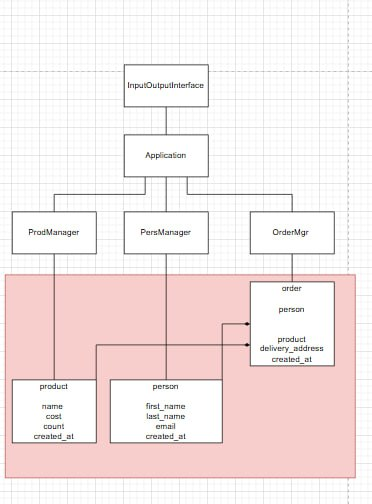

Министерство науки и высшего образования Российской Федерации  
Федеральное государственное бюджетное образовательное учреждение  
высшего образования  
«Московский государственный технический университет  
имени Н.Э. Баумана  
(национальный исследовательский университет)»  
(МГТУ им. Н.Э. Баумана)

ФАКУЛЬТЕТ ИНФОРМАТИКА И СИСТЕМЫ УПРАВЛЕНИЯ  
КАФЕДРА КОМПЬЮТЕРНЫЕ СИСТЕМЫ И СЕТИ (ИУ6)

 

ОТЧЕТ  
к лабораторной работе №1  
по дисциплине "Современные технологии разработки  
программного обеспечения"  
Реализация приложения в многоуровневой архитектуре  
с использованием удалённого репозитория кода

 

Преподаватель: Фетисов М.В.

Студент группы ИУ6-54Б Карпихин Глеб Игоревич, Кошенков Дмитрий Олегович.

## Описание задания

Задача № 4: "Интернет магазин".

Диаграмма:

[фото](doc/diagram.jpg)

Составьте отчёт для курьера вашего интернет-магазина с
информацией об адресах доставки товаров, основываясь на данных
оплаченных, но ещё не развезённых заказах.